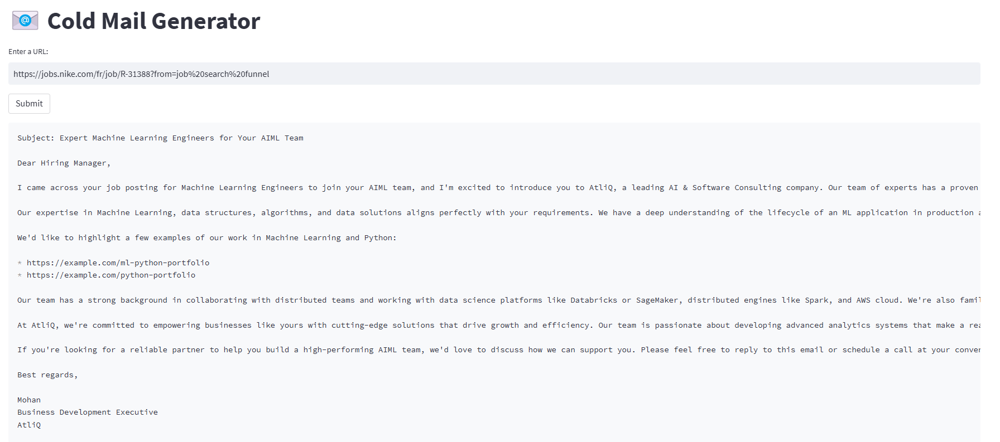

# Cold Email Generator

This project is a **Cold Email Generator** designed for service-based companies using **Groq**, **Langchain**, and **Streamlit**. It allows users to input the URL of a company’s careers page, extracts job listings, and generates personalized cold emails tailored to each job posting. The tool also includes portfolio links relevant to the job description, which are sourced from a vector database.

## Example Scenario:

Imagine a scenario where:
- **Nike** is looking for a **Expert Machine Learning Engineer** and is spending considerable time and resources on the hiring process (recruitment, onboarding, training, etc.).
- **Atliq**, a software development company, wants to provide a dedicated software engineer to Nike. To do this, a business development executive from Atliq (Mohan) reaches out to Nike with a personalized cold email offering their services.

The email will be crafted using the company’s job description, making it relevant and increasing the chances of engagement.

## Features

- **Web scraping of job listings**: Input a company’s careers page URL to extract job listings.
- **Personalized email generation**: Automatically generate cold emails tailored to each job description.
- **Portfolio matching**: Integrates relevant portfolio links from a vector database to enhance the email.
- **Customizable**: Users can tweak email templates and personalize fields like recipient name, company name, and job roles.

## Technologies Used

- **Groq**: For handling requests and processing data.
- **Langchain**: To integrate and chain the language model tasks.
- **Streamlit**: For building a simple and interactive web interface.
- **Vector Database**: For sourcing portfolio links relevant to the job description.
